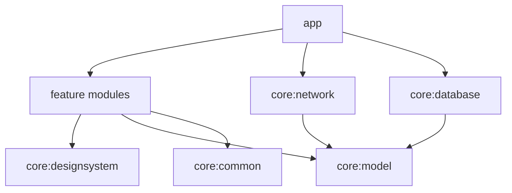

# ARTIFACE

Playful artistic selfie → caricature app for Android.

Kotlin · Jetpack Compose · CameraX · Hilt · Room · DataStore · WorkManager · Retrofit

## Current status

**Phase 8 — Testing & documentation (MVP complete)**

- GitHub Actions CI (unit tests, lint, debug APK)
- Architecture + testing docs
- Result ViewModel coverage added
- Version `0.8.0-phase8`

## Quick start

Requirements: Android Studio (or JDK 17+), Android SDK Platform 36.

```powershell
$env:JAVA_HOME = "C:\Program Files\Android\Android Studio\jbr"
.\gradlew.bat :app:assembleDebug
.\gradlew.bat testDebugUnitTest
.\gradlew.bat :app:lintDebug
```

Install the debug APK from `app/build/outputs/apk/debug/`.

Optional remote backend (defaults stay local/fake):

```kotlin
// app/build.gradle.kts BuildConfig
ARTIFACE_BASE_URL = "https://your-host/"
USE_REMOTE_GENERATOR = true
```

## Documentation

| Doc | Contents |
|-----|----------|
| [`docs/ARCHITECTURE.md`](docs/ARCHITECTURE.md) | Modules, flows, persistence, generation pipeline |
| [`docs/TESTING.md`](docs/TESTING.md) | Test commands, coverage map, CI |
| [`docs/BACKEND_API.md`](docs/BACKEND_API.md) | Proposed REST contract |
| [`docs/CAMERA_TESTING.md`](docs/CAMERA_TESTING.md) | Emulator / device camera checklist |

## Modules

| Module | Role |
|--------|------|
| `app` | Application entry, navigation, DI, WorkManager factory |
| `core:common` | Shared Result / dispatchers / contracts |
| `core:designsystem` | Theme, typography, Compose components |
| `core:model` | Immutable domain models |
| `core:network` | OkHttp, Retrofit API, DTOs, remote generator |
| `core:database` | Room (gallery results + generation jobs) |
| `core:preferences` | DataStore user preferences |
| `core:testing` | Shared test helpers |
| `feature:*` | Onboarding, camera, preview, processing, result, gallery, settings |

## Architecture (preview)



## MVP limitations

- Default generator is a local stylized mock (tint + title overlay), not a remote model
- Remote path is opt-in and assumes `docs/BACKEND_API.md`
- Interrupted generation jobs require an explicit Retry
- Failed jobs are not stored in the gallery (completed results only)
- Preview zoom/pan is visual only (no destructive crop write-back)
- No API keys are embedded; auth/BFF is deferred
- Validate camera flash/orientation on a physical device when possible
