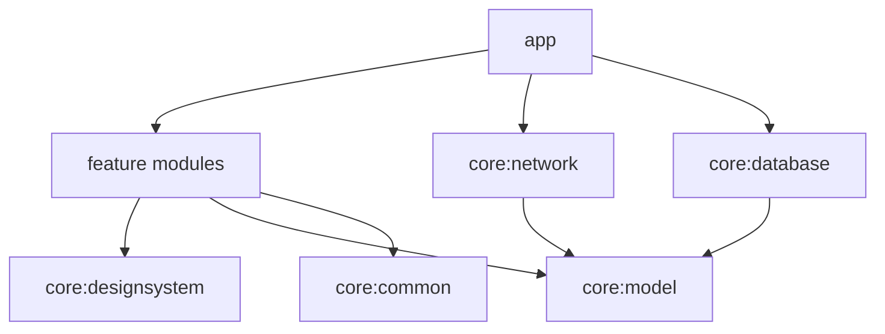

# ARTIFACE

Playful artistic selfie → caricature app for Android.

> Phase 1 foundation is in place. Full product docs land in Phase 8; this README is intentionally minimal until then.

## Current status

**Phase 4 — Generation flow**

- Style selection (six styles including Surprise Me)
- Fake generation repository with full status state machine
- Animated processing screen with rotating humorous copy
- Result reveal with share, save, favourite, and next actions

## Modules

| Module | Role |
|--------|------|
| `app` | Application entry, navigation, DI composition |
| `core:common` | Shared Result / dispatchers |
| `core:designsystem` | Theme, typography, reusable Compose components |
| `core:model` | Immutable domain models |
| `core:network` | OkHttp / future Retrofit shell |
| `core:database` | Room shell |
| `core:preferences` | DataStore-backed user preferences |
| `core:testing` | Shared test helpers |
| `feature:*` | Feature UI shells (onboarding, camera, …) |

## Setup

Requirements:

- Android Studio (or JDK 17+)
- Android SDK Platform 36

1. Set `JAVA_HOME` to a JDK 17+ install (Android Studio JBR works):

```powershell
$env:JAVA_HOME = "C:\Program Files\Android\Android Studio\jbr"
```

2. Sync Gradle in Android Studio, or from the terminal:

```powershell
.\gradlew.bat :app:assembleDebug
.\gradlew.bat :core:common:test
```

## Architecture (preview)



## Phase 4 limitations

- Generated art is a local stylized mock (tint + title overlay), not a remote model
- Results live in memory + files until Room gallery arrives in Phase 5
- Forced failure simulation exists on `FakeCaricatureGenerator.forceNextFailure` for tests/debug
- Physical-device camera validation still recommended — see `docs/CAMERA_TESTING.md`
