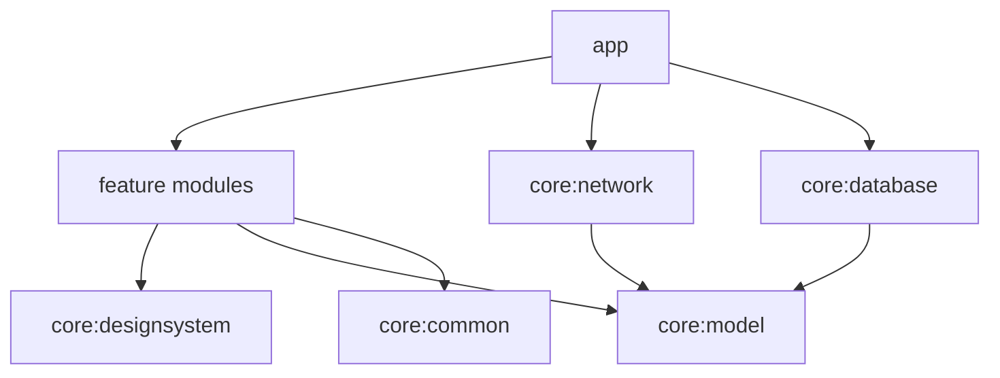

# ARTIFACE

Playful artistic selfie → caricature app for Android.

> Phase 1 foundation is in place. Full product docs land in Phase 8; this README is intentionally minimal until then.

## Current status

**Phase 1 — Foundation (complete once green build)**

- Modular Clean Architecture skeleton
- Jetpack Compose + Material 3 design system
- Hilt dependency injection
- Navigation shell for the full user journey
- Splash → onboarding placeholder routing
- Domain models in `core:model`
- Network / database DI shells (no backend required)

## Modules

| Module | Role |
|--------|------|
| `app` | Application entry, navigation, DI composition |
| `core:common` | Shared Result / dispatchers |
| `core:designsystem` | Theme, typography, reusable Compose components |
| `core:model` | Immutable domain models |
| `core:network` | OkHttp / future Retrofit shell |
| `core:database` | Room shell |
| `core:testing` | Shared test helpers |
| `feature:*` | Feature UI shells (onboarding, camera, …) |

## Setup

Requirements:

- Android Studio (or JDK 17+)
- Android SDK Platform 36

1. Set `JAVA_HOME` to a JDK 17+ install (Android Studio JBR works):

```powershell
$env:JAVA_HOME = "C:\Program Files\Android\Android Studio\jbr"
```

2. Sync Gradle in Android Studio, or from the terminal:

```powershell
.\gradlew.bat :app:assembleDebug
.\gradlew.bat :core:common:test
```

## Architecture (preview)



## Phase 1 limitations

- Feature screens are navigation placeholders (real UI starts Phase 2+)
- Splash always routes to onboarding (DataStore arrives Phase 2)
- No CameraX / Room / WorkManager / Retrofit API usage yet
- Custom brand fonts not bundled yet (system serif/sans fallbacks)
