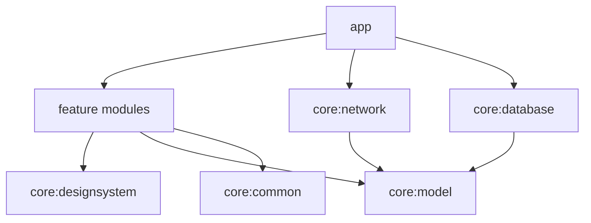

# ARTIFACE

Playful artistic selfie → caricature app for Android.

> Phase 1 foundation is in place. Full product docs land in Phase 8; this README is intentionally minimal until then.

## Current status

**Phase 7 — Network-ready layer**

- Retrofit `ArtifaceApi` + kotlinx.serialization DTOs and domain mappers
- `NetworkConfig` / BuildConfig switch: fake generator (default) vs `RemoteCaricatureGenerator`
- Backend contract documented in `docs/BACKEND_API.md`

## Modules

| Module | Role |
|--------|------|
| `app` | Application entry, navigation, DI composition, WorkManager factory |
| `core:common` | Shared Result / dispatchers |
| `core:designsystem` | Theme, typography, reusable Compose components |
| `core:model` | Immutable domain models |
| `core:network` | OkHttp, Retrofit API, DTOs, remote generator |
| `core:database` | Room database, DAOs, gallery + job entities |
| `core:preferences` | DataStore-backed user preferences |
| `core:testing` | Shared test helpers |
| `feature:*` | Feature UI shells (onboarding, camera, …) |

## Setup

Requirements:

- Android Studio (or JDK 17+)
- Android SDK Platform 36

1. Set `JAVA_HOME` to a JDK 17+ install (Android Studio JBR works):

```powershell
$env:JAVA_HOME = "C:\Program Files\Android\Android Studio\jbr"
```

2. Sync Gradle in Android Studio, or from the terminal:

```powershell
.\gradlew.bat :app:assembleDebug
.\gradlew.bat :core:common:test
```

3. To point at a real backend (optional):

```kotlin
// app/build.gradle.kts BuildConfig fields
ARTIFACE_BASE_URL = "https://your-host/"
USE_REMOTE_GENERATOR = true
```

## Architecture (preview)



## Phase 7 limitations

- Default path remains the local fake generator — no production backend is required to run the app
- Remote path assumes the contract in `docs/BACKEND_API.md` and HTTPS (cleartext is blocked)
- No API keys are embedded; auth/BFF is deferred
- Interrupted jobs still require explicit Retry (Phase 6 behaviour)
- Physical-device camera validation still recommended — see `docs/CAMERA_TESTING.md`
