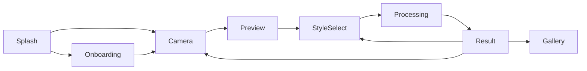
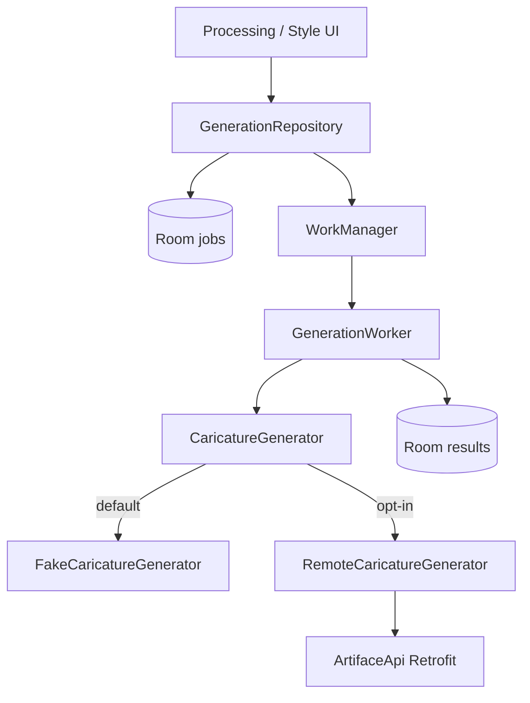

# Architecture

ARTIFACE is a modular Android app (Kotlin, Jetpack Compose, Hilt) that turns a selfie into a playful caricature. The MVP runs fully on-device with a fake generator; a Retrofit remote path is ready when a backend exists.

## Goals

- Clean Architecture / MVVM with unidirectional data flow
- Feature modules that own UI + ViewModels; shared cores for model/data infrastructure
- Local-first persistence (DataStore preferences, Room gallery/jobs)
- Durable generation via WorkManager
- Network-ready contracts without requiring paid/cloud services for local demos

## Module map

| Module | Responsibility |
|--------|----------------|
| `app` | Application, NavHost, Hilt composition, WorkManager factory, BuildConfig switches |
| `core:common` | Shared result types, dispatchers, generation/selfie contracts |
| `core:designsystem` | Theme, typography, reusable Compose components |
| `core:model` | Immutable domain models + style catalog |
| `core:preferences` | DataStore-backed user preferences |
| `core:database` | Room DB (results + generation jobs) |
| `core:network` | OkHttp/Retrofit, DTOs, mappers, `RemoteCaricatureGenerator` |
| `core:testing` | Shared test helpers |
| `feature:*` | Onboarding, camera, preview, processing, result, gallery, settings |

## Primary user journey

1. **Splash** — routes by onboarding completion flag  
2. **Onboarding** — three pages; persisted via DataStore  
3. **Camera** — CameraX fullscreen capture → app-scoped selfie file  
4. **Preview** — retake / continue  
5. **Style selection** — six styles including Surprise Me  
6. **Processing** — WorkManager job + animated status UI  
7. **Result** — reveal, favourite, share, save  
8. **Gallery** — Room-backed grid with favourites filter + delete  

## Generation pipeline

- `FakeGenerationRepository` persists jobs, enqueues unique WorkManager work, recovers interrupted jobs as Failed + retry  
- `CaricatureGenerator` is selected by `NetworkConfig.useRemoteGenerator` (`BuildConfig.USE_REMOTE_GENERATOR`)  
- Completed results land in Room for the gallery  

## Persistence

| Concern | Store |
|---------|-------|
| Onboarding / theme / personalization toggles | DataStore (`core:preferences`) |
| Gallery caricatures | Room `caricature_results` |
| In-flight generation jobs | Room `generation_jobs` |
| Selfie / result JPEGs | App-scoped `files/selfies/` and `files/results/` |

## Network

See [`BACKEND_API.md`](BACKEND_API.md). Defaults:

- `ARTIFACE_BASE_URL=https://api.artiface.example/`
- `USE_REMOTE_GENERATOR=false` (local fake)

No API keys are embedded in the client.

## Testing & CI

See [`TESTING.md`](TESTING.md). GitHub Actions runs unit tests, app lint, and debug assemble on every push/PR to `main`.
